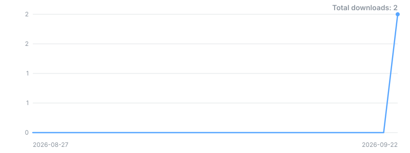

# aura-life

[](https://github.com/Redrum624/aura-life/releases)
[](https://github.com/Redrum624/aura-life/releases/latest)


-blue)

> **aura-life** — *a life that keeps running when nobody is watching.*

**An agent life-simulation engine.** Give a persona a `LifeService` and it
acquires an inner life that runs whether or not anyone is talking to it: energy
and fatigue cycles, a daily plan it writes for itself, goals it invents and
abandons, moods that drift, a home with rooms and weather, a job, money, errands,
skills, friendships, and experiences worth mentioning next time you speak. Two
lines of setup and twenty ticks later, your agent has had a day — and can tell you
about it.

The usual alternative is a prompt that *claims* a backstory, regenerated from
scratch on every request. This is the other thing: **state, not narration.** The
engine holds no LLM, no HTTP layer and no user accounts; everything belonging to
the surrounding application arrives through a twelve-function hook registry the
host fills in at startup. A host-free process still runs a complete life — just
without narration, real weather or place lookups.

## Why aura-life

- **N agents, one world, one process.** No `LifeService` state lives in a
  module-level singleton, so instances cannot collide — three agents sharing one
  `WorldEnvironment` is an asserted test, not an aspiration. (The two
  per-persona caches that *are* process-global are keyed by persona id and have
  explicit teardown.)
- **The host seam is twelve functions wide.** `aura_life.hooks` imports `typing`
  and nothing else, which is the structural guarantee that plugging in your
  application can never drag your application into the simulation.
- **It degrades instead of dying.** Miss a hook and that one feature reports
  "unavailable"; the tick still completes. The unguarded exceptions are counted,
  named, and pinned by a test rather than left for you to find.
- **The public surface cannot move by accident.** 117 exported names, pinned
  against a committed snapshot; regenerating it is opt-in and shows up in the
  diff.
- **32,088 lines across 82 modules and 32 subpackages** as extracted — 32,949
  across 83 after the pre-publication hardening — with exactly one runtime
  dependency, and only on Windows.
- **The defects are in the repo, not in a private tracker.** `DEFERRED.md` names
  what is shipped unfixed and what it costs you.

## Install

The repository is public at `github.com/Redrum624/aura-life`. **There is no PyPI
package**; install from a checkout, as an editable path dependency:

```bash
git clone https://github.com/Redrum624/aura-life.git
python -m pip install -e ./aura-life
python -m pip install -e "./aura-life[scheduler]"    # ...or with the optional extra
```

Both `pip` lines are run from the directory that *contains* the checkout, so a
sibling project can depend on it in place with `-e ../aura-life`.

- **`[scheduler]`** installs `apscheduler`. Only `LifeService.start()` needs it —
  that is the background thread that ticks the simulation on real-world intervals.
  Without it `start()` logs `APScheduler not installed. Life simulation will run
  manually.` and returns; **you drive the ticks yourself, which is what the
  quickstart below does.** The quickstart's output was produced in an environment
  where `HAS_APSCHEDULER` is `False`.

  **`start()` needs a running asyncio event loop.** APScheduler's
  `AsyncIOScheduler` binds to the *running* loop at start time, so calling
  `start()` from synchronous code has no loop to bind. That is not an error you
  have to handle: the scheduler logs why and falls back to exactly the manual
  mode above, so a synchronous host behaves the same whether or not it installed
  this extra. If you want the background ticks, call `start()` from inside an
  event loop (an async web server, or `asyncio.run()`); otherwise drive
  `force_all_ticks()` yourself on whatever clock you own.
- **`tzdata`** is a hard dependency on Windows only (`sys_platform == "win32"`),
  and is installed for you. Windows ships no system IANA timezone database, and
  without it every persona timezone silently falls back to server-local time.

## Quickstart

Two personas living in one shared world, with no host application at all.

```python
"""Two personas, one shared world, no host application."""
import logging

from aura_life import LifeService
from aura_life.world import WorldEnvironment

# One WARNING per activity tick is expected with no host -- see "Limitations".
logging.basicConfig(level=logging.WARNING, format="%(levelname)s %(message)s")

world = WorldEnvironment()           # one world...

agents = [                           # ...two lives in it, one SQLite file each
    LifeService(
        db_path=f"{name}.db",
        persona_id=name,
        world_environment=world,
        occupation=occupation,
        interests=interests,
    )
    for name, occupation, interests in [
        ("mara", "baker", ["bread", "weather"]),
        ("theo", "nurse", ["running", "jazz"]),
    ]
]

# There is no public tick(): the caller owns the clock. LifeService never ticks a
# world it was handed -- a shared clock belongs to whoever created it.
for _ in range(20):
    world.tick()
    for agent in agents:
        agent._scheduler.force_all_ticks()

for agent in agents:
    s = agent.get_status()
    goal = (s["goals"]["active_goals"] or [{"title": "-"}])[0]["title"]
    print(f"{agent._persona_id:5} mood={s['affect']['mood']:9} "
          f"energy={s['energy_level']:9} "
          f"activities={s['recent_activities_count']:3} goal={goal!r}")

w = agents[0].get_status()["world"]
print(f"world {w['time_of_day']}, {w['weather']}, {w['season']} - both agents see this one")
```

What it actually prints (exit code 0, `mara.db` and `theo.db` created, nothing
else written):

```text
WARNING Failed to persist activity emotions: aura_life hook 'get_config' is not configured; the host application must call aura_life.hooks.configure(get_config=...)
    ... that same WARNING roughly 40 times — once per activity tick per agent.
    Runs have produced 38, 39, 40 and 42; the count is not deterministic.
    Not an error; see Limitations. Elided here only for readability.
mara  mood=content   energy=high      activities= 20 goal='Appreciate something beautiful'
theo  mood=content   energy=medium    activities= 20 goal='Appreciate something beautiful'
world late_night, clear_night, summer - both agents see this one
```

The last three lines differ from run to run: `WorldEnvironment` starts from the
wall clock, weather is random, and goals are generated. What is stable is the
shape — both agents advance, both keep their own database, and both read the same
world.

Four things in that snippet are load-bearing and easy to get wrong:

1. **`world_environment=` makes the world shared, and shared means yours.**
   `LifeService` skips its own `self._world.tick()` when it was handed a world, so
   nothing advances until *you* call `world.tick()`. Omit the argument and each
   service builds and ticks a private world instead.
2. **`db_path=` is effectively required.** With no host configured there is
   nothing to resolve a path from, and the constructor raises `ValueError` rather
   than guessing. With a host configured you may omit it and get
   `data_dir/<persona_id>/life.db`.
3. **`agent._scheduler.force_all_ticks()` runs the five internal ticks**
   (`world`, `energy`, `plan`, `activity`, `goal`) once each, synchronously. This
   reaches through a private attribute because there is no public equivalent —
   see [Limitations](#limitations).
4. **Pass everything by keyword.** `LifeService.__init__` takes 19 positional
   parameters; `persona_id` is the ninth.

`tests/test_multi_instance.py` is the executable version of this quickstart, with
assertions: three agents, one world, no `ERROR` records, no state leaking between
databases.

## Module index

Thirty-two subpackages. Each owns one slice of the simulation and talks to the
others only through `LifeService`, which is the orchestrator — engines never call
each other directly.

| Subpackage | What it owns |
|---|---|
| `activities` | Activity selection and execution, and the narrative line each one produces. |
| `affect` | Background mood and cumulative stress — the emotional undertone that outlives a spike. |
| `behavior` | Routine detection from repeated activity, and creative artifacts: poems, sketches, playlists. |
| `body` | Physical state — general health, minor ailments, an optional hormonal cycle — and its pull on mood and energy. |
| `chaos` | Cross-cutting randomness: unexpected twists mid-activity, serendipity, entropy injected into the other engines. |
| `cognitive` | Focus and flow state, rumination loops, the quality of attention. |
| `context` | Assembles the prompt-context sections a host feeds its LLM, under a token budget. |
| `continuity` | The slow cycles — anniversaries, growth snapshots, life chapters — that build long-term meaning. |
| `drive` | Motivational drives beyond goals: curiosity sparked by experience, avoidance and its accumulating guilt. |
| `emotion` | Concurrent emotions with intensity, decay and blending; a three-tier feelings wheel; text emotion analysis; persistence across restarts. |
| `energy` | Energy levels, fatigue, circadian rhythm, boosts. |
| `errands` | An everyday to-do backlog that accrues, slips to overdue, and nags through `affect`. |
| `expression` | Connection awareness (online/offline, response timing) and communication style. |
| `goals` | Self-generated goals with a full lifecycle: invented from personality and experience, pursued, completed, abandoned. |
| `habitation` | The living space — tidiness decays, cleaning restores it, the room reads as lived-in. |
| `identity` | Emergent self-identity facets reinforced by activity, plus mental models of the user and of NPCs. |
| `intimacy` | Private desire, arousal and intimate feeling. |
| `job` | Career and work life: a weekly shift schedule, an `on_shift` state, progression over time. |
| `life_events` | Significant moments — achievements, discoveries, surprises — recorded as things worth sharing. |
| `location` | The known-places registry and familiarity, home-city resolution, and the device-location store. |
| `memory_time` | Subjective time perception, seasonal consciousness, nostalgia, life narrative, anticipation. |
| `money` | A light evolving ledger: income, purchases, financial stress. |
| `persona_evolution` | Slow personality drift from lived experience, bounded by a maximum drift. |
| `personas` | The persona pipeline: genre randomisation, personality configuration, the profile database and parser, place and appearance generation. |
| `planner` | The daily plan — generated once a day, followed through, revised on user command. |
| `scheduler` | The tick loop. APScheduler-backed when the extra is installed; `force_all_ticks()` either way. |
| `shadow` | The darker inner psychology: felt insecurity, temptation and transgression, secrets. |
| `skills` | Competencies that grow with practice and emit milestone texts when they cross a threshold. |
| `social` | NPC interactions, social events, friend activity. |
| `sustenance` | Hunger, meals and nutrition — wired to `energy` on one side and `money` on the other. |
| `transportation` | Travel-time estimation and the persona's get-around mode. |
| `world` | The shared world: locations, weather, seasons, the clock, cherished objects. |

Nine modules sit at the top level:

| Module | What it is |
|---|---|
| `life_service.py` | The orchestrator. Every engine hangs off it; it owns the database and routes signals between subsystems. By far the largest file. |
| `models.py` | The shared dataclasses and enums the engines exchange. |
| `schedule.py` | Weekly persona schedules and the per-persona schedule cache. |
| `conversation_session.py` | Per-conversation session state. |
| `hooks.py` | The host-hook registry. Imports `typing` and nothing else. |
| `defaults.py` | The one library-supplied hook implementation, `persona_now`. |
| `internals.py` | An eight-line unstable re-export namespace. |
| `__init__.py` | The curated facade — the 117 stable names. |
| `_safe_ids.py` | Private. Persona-id validation and containment-checked path joins. |

## The public surface

`aura_life` exports **117 names** and that is the stable API. 114 of them are
inherited verbatim from the origin project's engine package; `hooks` and
`HookNotConfigured` were added by the extraction.

```python
from aura_life import LifeService, Weather, Goal, hooks   # stable
```

### `aura_life.internals` — what it actually is

`internals.py` is eight lines. It re-exports **`LifeService`, all of `models`, and
all of `context`** — and nothing else:

```python
from aura_life.life_service import LifeService
from aura_life.models import *
from aura_life.context import *
```

Measured against the facade, it adds **15 names** beyond the 117 — and **8 of
those are leaked stdlib/typing symbols** (`Dict`, `List`, `Optional`, `Enum`,
`dataclass`, `field`, `datetime`, `json`) that the wildcard imports dragged in.
The 7 real additions are `BehavioralTendency`, `CalendarEntry`, `ErrandsState`,
`InebriationState`, `LOCATION_ENUM_TO_KEY`, `LifeContextBuilder` and
`PlaceLocationState`. **It is explicitly not stable and may change in a minor
release.** It exists so the origin application could finish migrating without
being blocked on the facade; treat an import from it as a to-do, not an API.

**It does not re-export the subsystem classes.** `EmotionEngine`,
`TextEmotionAnalyzer`, `WorldEnvironment`, `EnergySystem`, `GoalEngine`,
`ActivityEngine`, `LifeScheduler`, `get_emotion_persistence`,
`clear_emotion_persistence`, the `personas` entry points and 17 more — **27 names
declared in submodule `__all__`s** — are on neither `aura_life` nor
`aura_life.internals`.

**Everything else is reached by its real module path**, which is a supported,
working import — just not a stable one:

```python
from aura_life.world import WorldEnvironment
from aura_life.emotion import EmotionEngine, TextEmotionAnalyzer
from aura_life.energy import EnergySystem
from aura_life.personas import get_personality
```

(`aura_life.hooks` is the exception among submodules: it *is* exported by the
facade, so its 17 otherwise-unreachable names are reachable as
`aura_life.hooks.configure` and friends. One of them, `persona_now`, is declared
in both `aura_life.defaults.__all__` and `aura_life.hooks.__all__` — it counts as
a hook name, not a path-only one, because `from aura_life.hooks import
persona_now` works.)

A public home for the subsystem classes is a **v0.2** decision, not a bug —
nothing here is broken, and the paths above are how consumers import them today.

`tests/test_api_surface.py` pins `__all__` against a committed snapshot
(`tests/api_surface.json`), so the public surface cannot change without the diff
saying so. Regenerating that snapshot is opt-in: `API_SURFACE_WRITE_SNAPSHOT=1`.

## The hooks contract

The engine simulates a life; it does not own the machine it runs on. Config, the
LLM, weather, geocoding, images, the persona datastore and the persona clock all
belong to the host. `aura_life.hooks` is the single seam between the two, and it
imports nothing but `typing` — that is its guarantee that the seam can never drag
the host in.

A host registers implementations once, at startup:

```python
from aura_life import hooks

def _get_config():
    from myapp.config import get_config        # imported at CALL time, not install time
    return get_config()

hooks.configure(get_config=_get_config, get_llm_service=..., ...)
```

`configure()` refuses a name that is not a known hook, so a typo in a bridge fails
loudly at startup instead of silently at the first call months later. The pattern
that works is one thin wrapper per hook, each performing its import lazily so
monkeypatching in tests still works.

The twelve hooks:

| Hook | What the host supplies |
|---|---|
| `get_config` | the configuration object (`.data_dir`, `.place_enabled`, …) |
| `get_user_data_root` | root directory for per-user data |
| `get_persona_datastore` | the persona's consolidated datastore |
| `get_image_service` | image / self-photo service |
| `resolve_outfit_for_context` | which outfit fits the current schedule context |
| `get_schedule_phase` | coarse phase of the persona's day (`"morning"`, `"evening"`, …) |
| `generate_and_update` | regenerate and persist the persona's visual description |
| `get_weather_service` | real weather observations (distinct from the world sim) |
| `get_llm_service` | the LLM client |
| `geocode` | place name → `{city, country, lat, lon, timezone}` |
| `resolve_timezone` | coordinate → IANA timezone string |
| `persona_now` | "now" in the persona's timezone — **the one hook with a library default** |

**An unconfigured hook raises `HookNotConfigured`, a subclass of `ImportError`.**
That inheritance is deliberate and load-bearing: these calls replaced
function-local `from config import get_config` statements whose failure mode was
`ModuleNotFoundError` (itself an `ImportError`), so every `except ImportError`
guard already written around those call sites keeps behaving exactly as it did.
Most call sites catch it, log a `WARNING`, and degrade that one feature to
"unavailable".

Registry helpers:

- `hooks.configure(**providers)` — register; idempotent, re-registering overwrites.
- `hooks.reset()` — forget everything, including the library's own default.
- `hooks.is_configured(name)` — is there *a* provider?
- `hooks.provider_for(name)` — *which* provider? (the only way to tell a library
  default from a host registration; see Limitations)

### `persona_now`, the one library default

`persona_now` is a clock, not a host resource, and the standard library already
has one. `aura_life/defaults.py` registers a `zoneinfo`-based implementation when
the package is imported. It exists because `LifeService.persona_local_now()` calls
that hook **unguarded**: without a default, every `activity` tick of a host-free
`LifeService` dies inside the scheduler, which swallows the exception and logs it
at `ERROR`. The library would import cleanly, construct cleanly, tick forever and
simulate nothing.

`defaults.install()` never overwrites a provider that is already registered, so a
host bridge that registers its own `persona_now` — a virtual or frozen clock, say
— cannot be silently downgraded to the system clock. `hooks.reset()` drops it
along with everything else.

## The two per-persona providers

Two host behaviours are per-persona rather than per-process, so they are
constructor arguments on `LifeService` rather than hooks:

| Argument | Called as | The engine then uses |
|---|---|---|
| `user_model_provider` | `provider(persona_id)` | `.bid_response_rate`, `.quiet_windows`, `.observe_message(...)`, `.get_engaged_topics(n)`, `.get_disengaged_topics(n)` |
| `follow_up_provider` | `provider(persona_id)` | `.create_trigger(trigger_type, topic=…, context=…, urgency=…, …)` |

Both are duck-typed — the engine never imports a class or an enum for either.
Where a follow-up type is needed it passes the enum member's **name** as a plain
string (`"MOOD_SHIFT"`, `"DEPARTURE"`, …) and the host adapter turns it back into
whatever type it uses.

**Omitting both is the supported standalone path.** Every call site is guarded by
an `is None` check; the engine simply skips adaptive cooldowns and proactive
follow-up triggers. The quickstart above passes neither.

## Limitations

Honest list. None of these are theoretical.

**There is no public `tick()`.** Driving the simulation means
`svc._scheduler.force_all_ticks()`, which is a private attribute, and constructing
a shared world means `from aura_life.world import WorldEnvironment`, which is not
in the facade. Both are the documented way to do it today and both are v0.2
candidates (recorded in `DEFERRED.md`).

**`hooks.is_configured("persona_now")` is `True` with no host installed**, because
a library default *is* a registration. Use `provider_for` to tell them apart:

```python
from aura_life import defaults, hooks
hooks.provider_for("persona_now") is defaults.DEFAULT_PROVIDERS["persona_now"]
# True  -> the library's own clock; False -> the host's
```

**The `WARNING` a host-free tick emits is expected degradation, not a bug.** It
appears once per `activity` tick, per agent:

```text
Failed to persist activity emotions: aura_life hook 'get_config' is not configured;
the host application must call aura_life.hooks.configure(get_config=...)
```

`get_emotion_persistence()` calls `get_config` unguarded, but its caller in
`life_service.py` wraps the whole thing — so the feature degrades and the tick
completes. Note that the guard belongs to the *caller*: a new caller of
`get_emotion_persistence()` inherits the hazard, not the protection.

**Thirteen hook call sites are unguarded, and two of them sit on the `world` tick
path.** `_get_weather_service()` and `_geocode_trip()` both import their hook with
no `try/except`. A host-free consumer no longer reaches either — both paths now
begin with a `place_enabled` check that fails closed when `get_config` is
unreadable. **A host that registers `get_config` with `place_enabled` true and
omits `get_weather_service` walks into the first**, provided its agent owns its
world, is not an AI persona, and has a resolved lat/lon; injecting a `trip_llm` as
well reaches the second. The failure is silent, because `LifeScheduler.force_tick`
catches every handler exception and only logs it at `ERROR`.

`tests/test_hook_call_sites.py` is the authority for the census — it walks the
AST, pins the thirteen as an explicit allowlist keyed by module and function
rather than by line number, and fails when a new unguarded site appears.
`DEFERRED.md` carries the analysis and the ranked follow-ups.

**`LifeService.start()` needs `apscheduler`** (the `[scheduler]` extra) and is a
single-persona, background-thread design. For N agents in one process, drive the
ticks yourself as the quickstart does.

**Storage is one SQLite file per persona only while the library is host-free.**
Once the datastore hooks are configured the persona pipeline also creates
`<data_dir>/<persona_id>/profile.db` and a `<persona_id>_emotions.db`, and the
location subsystem writes a `.device_location.json` under the user data root.

**Relationship modelling is not here.** Persona↔user relationship state stayed in
the origin application on purpose — see `CHANGELOG.md`.

## Tests

```bash
python -m pytest tests -q          # 324 tests across 22 modules, no network
```

The suite must be run in an environment with **no host application on
`sys.path`**; `tests/test_multi_instance.py` asserts that explicitly, because
otherwise every "works standalone" claim in it would be vacuous. The notable
files:

| File | What it protects |
|---|---|
| `test_multi_instance.py` | three agents, one world, no host — no `ERROR` records, no cross-contamination |
| `test_hook_call_sites.py` | the unguarded-hook census; fails on a new unguarded site |
| `test_api_surface.py` | `__all__` cannot change silently |
| `test_persona_parity.py` | persona generation still matches the pre-extraction golden |
| `test_smoke.py` | the package imports at all, and reports a version |
| `test_persona_id_safety.py` | a persona id can never escape `data_dir`, and is rejected rather than repaired |
| `test_calendar_datastore.py` | the calendar API works with and without a host datastore |
| `test_collection_caps.py`, `test_life_service_retention.py`, `test_emotion_history_retention.py` | every capped collection and every retention prune |
| `test_life_service_failure_modes.py` | the kill switch fails closed; failures log instead of vanishing |

Nothing in the suite walks every module, so the "everything under `aura_life`
imports with no host application present" check is a manual one (it reports 82
— the 83 files minus `aura_life/__init__.py`, which is the package being
walked):

```bash
python -c "import pkgutil, importlib, aura_life; \
mods=[m.name for m in pkgutil.walk_packages(aura_life.__path__,'aura_life.')]; \
[importlib.import_module(m) for m in mods]; print(len(mods),'modules standalone')"
```

The parity golden and the API snapshot are committed fixtures. A missing one is a
**defect, not a fresh start**: both tests fail loudly rather than regenerating.
Regeneration is opt-in and requires the exact value `1`
(`PARITY_WRITE_GOLDEN=1`, `API_SURFACE_WRITE_SNAPSHOT=1`).

## Documentation

| File | What is in it |
|---|---|
| `CHANGELOG.md` | what shipped in 0.1.0, and the pre-publication hardening that landed after the tag |
| `DEFERRED.md` | the defect that was fixed before publication, the thirteen unguarded hook sites shipped unfixed, and the v0.2 API candidates |
| `LICENSE` | Apache-2.0, in full |
| `NOTICE` | the relicensing attribution — legally load-bearing, do not strip |

## Where this came from

aura-life was extracted from a larger private application by the same author,
who holds sole copyright in both and relicensed the extracted subset under
Apache-2.0. See `NOTICE`.

The extraction was a **pure move**: a golden snapshot of twenty simulated ticks
was captured against the pre-extraction code, and the post-extraction library
reproduces it byte for byte. Measured at extraction, **70 of the 78 moved
modules were line-for-line identical to their originals**, the remainder
differing only where imports had to be rewritten. `CHANGELOG.md` records what
moved, what deliberately did not, and what was fixed afterwards — because the
"no refactoring" contract
that made the parity proof meaningful ended at publication, and the security and
resource-leak findings from the pre-release audit were fixed rather than shipped.

## Downloads



## License

Apache-2.0. See `LICENSE` and `NOTICE`.

---

**aura-life** — *give a persona a `LifeService` and it starts having days.*
